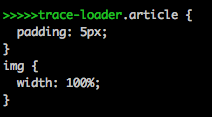

A webpack loader used to output source to `STDOUT`.

## Usage

Add trace-loader between loader pipeline:

    {
      test: /\.styl$/,
      use: [
        'css-loader',
        'postcss-loader',
        'trace-loader',
        'stylus-loader'
      ]
    }

then `trace-loader` will print all output generated from `stylus-loader` to `STDOUT`.

## Options

### prefix

You can add some text before by add a `prefix` option:

    {
      test: /\.styl$/,
      use: [
        'css-loader',
        'postcss-loader',
        'trace-loader?prefix=>>>>>trace-loader',
        'stylus-loader'
      ]
    }

